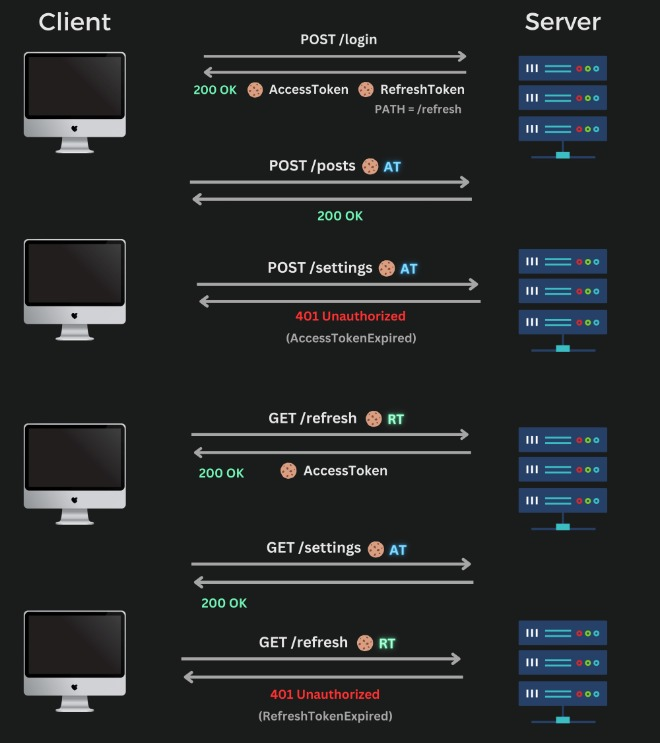

# Express TypeScript Authentication API

A robust, production-ready authentication API built with Express.js, TypeScript, and MongoDB. Features JWT-based authentication with automatic token refresh, comprehensive error handling, and a clean layered architecture.

## ✨ Features

- 🔐 **JWT Authentication** - Secure access and refresh token implementation
- 🔄 **Automatic Token Refresh** - Seamless user experience with token rotation
- 🏗️ **Clean Architecture** - Layered design with routes, controllers, services, and models
- 🛡️ **Type Safety** - Full TypeScript implementation with strict typing
- 📧 **Email Integration** - User verification and password reset via Nodemailer
- 🗄️ **MongoDB Integration** - Mongoose ODM with optimized schemas
- ⚡ **Error Handling** - Centralized error management with custom middleware
- 🧪 **Testing Ready** - Postman collection included for API testing

## 🏛️ Architecture

The API is built using different layers: routes, controllers, services and models.

- Routes are responsible for handling the incoming requests and forwarding them to the appropriate controller.
- Controllers are responsible for validating the request, calling the appropriate service, and sending back the response.
- Services are responsible for handling the business logic. They interact with the database and any external services. Services may also call other services.
- Models are responsible for interacting with the database. They contain the schema and any model utility methods.

\*\*\* For simple GET or DELETE requests that don't require any business logic, the controller may directly interact with the model.

#### Error Handling

Errors are handled using a custom error handler middleware. The error handler middleware catches all errors that occur in the application and processes them accordingly. Each controller needs to be wrapped with the `errorCatch()` utility function to ensure that any errors that are thrown within the controller are caught and passed on to the error handler middleware.

### Directory Structure

```
express-ts-auth/
├── src/
│   ├── api/                    # API layer
│   │   ├── controllers/        # Request handling & validation
│   │   ├── middlewares/        # Express middlewares
│   │   ├── routes/            # Route definitions
│   │   ├── services/          # Business logic
│   │   ├── validators/        # Input validation schemas
│   │   └── _types/           # API-specific types
│   ├── resources/             # Domain resources
│   │   ├── aws/              # AWS integrations
│   │   ├── database/         # DB configuration
│   │   ├── models/           # Mongoose models
│   │   ├── repositories/     # Data access layer
│   │   └── mailers/          # Email utilities
│   ├── shared/               # Shared modules
│   │   ├── config/           # App configuration
│   │   └── constants/        # Application constants
│   │   └── utils/                # Utility functions
│   │       ├── api/              # API helpers
│   │       ├── base/             # Base utilities
│   │       └── helpers/          # General helpers
│   ├── types/                # Global TypeScript types
│   └── server.ts             # Application entry point
├── .env                      # Environment variables
├── postman.json             # API testing collection
└── sample.env               # Environment template
```

## 🔐 Authentication Flow

The API implements a secure JWT authentication system with automatic token refresh:

### Token Strategy

- **Access Token**: Short-lived (15 minutes) - Used for API authentication
- **Refresh Token**: Long-lived (30 days) - Used only for token renewal
- **Storage**: Secure HTTP-only cookies prevent XSS attacks

### Flow Diagram



### Error Handling Flow

1. Client receives `401 AccessTokenExpired` error
2. Frontend automatically calls `/refresh` endpoint
3. New access token generated and sent via cookie
4. Original request automatically retried
5. If refresh fails, user redirected to login

## 🚀 Quick Start

### Prerequisites

- **Node.js** (v16 or higher) - [Download here](https://nodejs.org/)
- **MongoDB** - [Local installation](https://www.mongodb.com/docs/manual/installation/) or [MongoDB Atlas](https://www.mongodb.com/atlas/database)
- **Resend Account** - [Sign up here](https://resend.com) for email functionality

### Installation

1. **Clone and install dependencies**

   ```bash
   git clone <repository-url>
   cd express-ts-auth
   npm install
   ```

2. **Environment setup**

   ```bash
   cp sample.env .env
   # Edit .env with your configuration
   ```

3. **Start MongoDB** (if running locally)

   ```bash
   # Using Homebrew on macOS
   brew services start mongodb-community@7.0

   # Using systemctl on Linux
   sudo systemctl start mongod

   # Windows - MongoDB runs as a service by default
   ```

4. **Start the development server**
   ```bash
   npm run dev
   ```

The API will be available at `http://localhost:4004`

### Environment Variables

Create a `.env` file with the following variables:

```env
# Server Configuration
NODE_ENV=development
PORT=8000
API_BASE_PATH=/api/v1
CORS_ORIGIN=http://localhost:3000

# Database
DATABASE_URL=mongodb://localhost:27017/express-auth

# Email Configuration
FROM_EMAIL_ADDRESS=your-email@example.com
FROM_EMAIL_PASSWORD=your-email-password-or-api-key

# JWT Configuration
ACCESS_TOKEN_SECRET=your-super-secure-access-secret
REFRESH_TOKEN_SECRET=your-super-secure-refresh-secret
ACCESS_TOKEN_EXPIRES_IN=15m
REFRESH_TOKEN_EXPIRES_IN=7d

# JWT Cookie Configuration
ACCESS_TOKEN_COOKIE_NAME=access_token
REFRESH_TOKEN_COOKIE_NAME=refresh_token
```

## 🧪 Testing

### Postman Collection

Import the included `postman.json` collection into Postman for comprehensive API testing:

1. Open Postman
2. Click **Import**
3. Select the `postman.json` file from the project root
4. Collection includes all API endpoints with example requests

### Available Scripts

```bash
# Development
npm run dev          # Start with hot reload

# Production
npm run build        # Compile TypeScript
npm run start        # Run compiled code

# Testing
npm run test         # Run test suite
npm run test:watch   # Run tests in watch mode

# Code Quality
npm run lint         # ESLint check
npm run lint:fix     # Fix ESLint issues
npm run format       # Prettier formatting
```

## 📚 API Endpoints

### Authentication

- `POST /api/v1/auth/sign-up` - User registration
- `POST /api/v1/auth/sign-in` - User login
- `POST /api/v1/auth/sign-out` - User logout
- `POST /api/v1/auth/refresh-token` - Refresh access token
- `POST /api/v1/auth/verify-email` - Verify Email Address for Sign Up
- `POST /api/v1/auth/resend-verification-email` - Resend Verification Email for Sign Up
- `POST /api/v1/auth/forgot-password` - Request password reset
- `POST /api/v1/auth/reset-password` - Reset password with token

### User Management

- `GET /api/v1/users/:id` - Get user profile
- `PUT /api/v1/users/:id` - Update user profile
- `DELETE /api/v1/users/:id` - Delete user profile

### Session Management

- `GET /api/v1/sessions` - Get user sessions
- `DELETE /api/v1/sessions/:id` - Delete user session

## 🛠️ Development

### Code Style

The project uses ESLint and Prettier for consistent code formatting:

```bash
# Format code
npm run format

# Check linting
npm run lint

# Fix linting issues
npm run lint:fix
```

### Error Handling

All controllers must be wrapped with the `asyncHandler()` utility:

```typescript
import { asyncHandler } from '@/src/shared/utils/api/async-handler';

export const loginController = asyncHandler(async (req, res) => {
  // Controller logic here
});
```

### Adding New Features

1. **Create route** in `/api/routes/`
2. **Add controller** in `/api/controllers/`
3. **Implement service** in `/api/services/`
4. **Update model** in `/resources/database/models/` (if needed)
5. **Update repository** in `/resources/database/repositories/` (if needed)
6. **Add validation** in `/api/validators/`

## 🚀 Deployment

### Building for Production

```bash
npm run build
```

### Environment Considerations

- Set `NODE_ENV=production`
- Use strong JWT secrets (256-bit recommended)
- Configure MongoDB Atlas for production database
- Set up proper CORS origins
- Use environment-specific email sender addresses

### Docker Support

```dockerfile
FROM node:18-alpine
WORKDIR /app
COPY package*.json ./
RUN npm ci --only=production
COPY dist ./dist
EXPOSE 4004
CMD ["npm", "start"]
```

## 🤝 Contributing

1. Fork the repository
2. Create a feature branch (`git checkout -b feature/amazing-feature`)
3. Commit your changes (`git commit -m 'Add amazing feature'`)
4. Push to the branch (`git push origin feature/amazing-feature`)
5. Open a Pull Request

---

**Built with ❤️ using Express.js, TypeScript, and MongoDB**
